

<link href="css/zoom.css" rel="stylesheet">

## SoK: SSL/TLS Security Protocol Testing and Verification

Darion Cassel1, David Evans1

1University of Virginia, Charlottesville, Virginia, USA

#### Abstract

TLS/SSL implementations have been shown to be have a slew of vulnerabilities that can lead to violation of fundamental security properties. We classify current approaches to the testing of TLS implementations through the use of established taxonomies developed in the field of software engineering. Through the lens of this categorization, we assert that security protocol implementation vulnerabilities should be treated differently from traditional software faults because they are a violation of *two levels* of specification. On one level, they are an exceptional state of some protocol implementation’s state machine. On another level, they are a violation of a protocol model with the consequence of breaking some security property that model intends to guarantee. No current approaches work on both levels but we believe that in order to discover a security fault and understand the implications of that fault without human intervention an approach must be able to combine information from both levels of testing. We present a cohesive workflow that combines two approaches in order to discover faults and classify the semantic threat of those faults concurrently.

### I. Introduction
TLS/SSL was originated by the company *Netscape* in 1994 in order to solve the problem of securing HTTP traffic [1]. Netscape never released version 1.0 of its Secure Sockets Layer protocol (SSL) due to the discovery of serious security flaws in the protocol, but went on to release version 2.0 to the public in February of 1995. However, this version too contained many security flaws, leading to a redesign of the protocol and the release of version 3.0 in 1996 [2]. The name Transport Layer Security (TLS) was given to an upgrade of SSL version 3.0 called TLS 1.0 which was defined in January 1999 and was not meant to be inter-operable with SSL 3.0 [3]. 

Over the years many vulnerabilities have been found in TLS/SSL leading to the release of new versions of the protocol. TLS 1.1 was defined in April of 2006 in order to add protection against *cipher-block chaining* (CBC) attacks [4]. TLS 1.2 was defined in August of 2008 and it added *authenticated encryption*, removing the need for streaming and block ciphers and thus removing vulnerability to CBC attacks [5]. SSL 2.0 was formally deprecated in March of 2011. In June of 2011 the BEAST attack [6] exploiting predictable *initialization vectors* (IVs) is released. Although the changes of TLS 1.1 and TLS 1.2 protect against BEAST, the adoption was slow of these updates leading to a large swath of vulnerable servers. In September of 2012 Duong and Rizzo release the CRIME attack which exploits TLS compression [7], leading to a rollback of that feature. In February of 2013 the Lucky Thirteen attack is released that executes *padding oracle* attacks against CBC suites [8]. In October of 2014 the publication of the POODLE attack that also leverages a padding oracle to perform a man-in-the-middle attack leads to SSL version 3.0 being considered insecure [9]. SSL version 3.0 is formally deprecated in June of 2015 [10]. Work on TLS version 1.3 has begun as of July of 2016.

According to a classic definition from the field of software engineering, software testing consists of the dynamic verification that a program provides expected behaviors on a finite set of test cases [11]. However, this definition is too coarse for our purposes as software testing has evolved into a wide and diversified field. The primary difference between various approaches to testing lies in the level of human involvement required to facilitate the testing. On one end of the spectrum lies manual code review, where an individual reads over the source code of a program and attempts to find faults in it [12]. At the other end of the spectrum is fully automated testing requiring no interaction from an individual once testing has commenced [12]. We will focus on the automated testing landscape. Within this sub-field, several theories and methodologies have been extracted and used for the discovery of security vulnerabilities.

The main approaches to testing can be classified at a high level by their level of abstraction. At the lowest level there is dynamic analysis of a running system, followed by static analysis of a code base, and finally at the highest level there is model-checking. Despite there being a wide literature of testing security protocols for vulnerabilities, we find that the there is a clear separation to these approaches leading to inherent limitations for each category in terms the kinds of security vulnerabilities they can discover. Furthermore, there is a lack of a cohesive framework to place each approach into a distinct category such that its merits can be evaluated in terms of its peers.

We are motivated to provide a framework for the classification of security protocol testing and verification approaches in order to address these issues. We find that in the light of a granular framework, clear similarities and differences can be found within approaches. Correspondingly we also seek to provide a framework for the classification of the possible results of an approach. We believe that these combined classifications will explain what features of a particular approach are essential to the kinds of results it discovered, what features are common amongst approaches and may be abstracted into a larger framework, and which approaches can be combined to leverage multiple pieces of information to generate more meaningful results.

Our primary contributions are: (1) Establishing a framework for fine-grained classification of security protocol testing methodologies. (2) Determining a framework for the categorization and evaluation of the results of different testing approaches. (3) Providing a holistic comparison of multiple approaches on the basis of their classification and the classification of their results. (4) Proposing a 'combined approach' that leverages two or more distinct approaches to discover a security vulnerability at the level of an exceptional state of a protocol implementation and to determine the threat or meaning of the vulnerability by concurrently determining the way in which it violates the protocol model's security guarantees. (5) Identification of challenges for future research. 

In Section II, we provide background on TLS/SSL at the protocol level and define terminology for software testing and protocol verification. Then, in Section III, we give a framework for the classification of methodologies and their results. In Section IV we proceed to use this framework to classify a series of 'representative approaches'. We provide a comparison of methodologies and results in Section V, and present a combined approach and its results in Section VI-VII. Finally we discuss related works in Section VIII and conclude with a discussion of possible future research in Section IX.

### II. Background and Definitions

#### Background on SSL/TLS

The TLS protocol is designed to provide encryption, authentication, and data integrity to the parties using the protocol. In order for this to occur, the two parties first participate in the TLS *handshake protocol* which includes a component of *certificate validation*. Once that is complete data is exchanged though the use of the *record layer protocol*. Most efforts to test and verify TLS have found vulnerabilities in the handshake protocol and the certificate validation phase. As such we will focus on describing them in detail here.

*A. The TLS Handshake*

Let us consider two parties, Alice and Bob. The primary goal of the handshake is to provide privacy and reliability for Alice and Bob's communications through the establishment of secret keys. 

 
Fig. 1: TLS Handshake [13] 

At a fundamental level, the handshake consists of three messages. The first is the *ClientHello* message with which Alice initiates the protocol, transmits her SSL/TLS version number and sends a set of cryptographic algorithms she supports called the *ciphersuite*.

Bob will then reply with the *ServerHello* message that has his choice of TLS protocol version, a choice of ciphersuite, and his certificate. When Alice receives this messages she must perform certificate validation on the Bob's certificate, and must agree to the choices of protocol version and ciphersuite. 

If Alice accepts Bob's certificate and accepts the shared SSL/TLS version and cipher, then the client initiates a *key exchange protocol*, namely RSA or Diffie-Hellman, which allows for the establishment of a symmetric key to be used for the rest of the connection.

It should be noted that SSL 3.0 onwards supports *session resumption* [33]. During the first run of the TLS protocol between Alice and Bob, they go through the full handshake protocol as detailed above. However, on future connections, session resumption allows for re-connection without use of the an abbreviated handshake. Specifically, if Alice sends a ClientHello message that includes a *session identifier* of a session that Bob has recorded as active, then Bob will assume that Alice wants to resume that previous session. A new secret is not exchanged, instead the previous keys are recomputed with new nonces and used. 

*B. Certificate Validation*

X.509 certificate validation is perhaps the most complex piece of the TLS handshake protocol. It involves the use of a transitive process called *chain of trust verification*. Each SSL/TLS client trusts a certain number of certificate authorities (CAs) whose X.509 certificates are usually included with the client's Operating System or browser [32]. This is considered to be the client's *root of trust*.

 
Certificate Chain of Trust

Each X.509 certificate that the client receives from a server it is attempting to connect with has an *issuer* field that contains the name of the certificate authority (CA) that issued the certificate. This server certificate is required to be accompanied by the certificate of the issuing CA, and if that issuer is not a *root CA*, then all of the certificates up to the root CA need to be included. It is this chain of certificates going from a server certificate to a root CA, the chain of trust, that needs to be validated by the client. Due to the complexity of the X.509 certificates themselves, this is not a simple task. Some of the checks involved in validating the chain are [14]:

- Checking that each certificates in the chain is signed by a CA immediately above it and the root of the chain is a client's trusted root CA.
- If the certificate is a version 1 or version 2 certificate then the client must either reject it or verify it by out-of-band means
- Certificates can have extensions. Each of these is either designated as *critical* or *non-critical*. A certificate with an unrecognized (by the client) critical extension must be rejected.
- If a certificate contains a *name constraints* extension, then the subject name in the next certificate in the chain must satisfy those name constraints. This is considered a critical extension.

It is due to this complexity that the certificate validation phase of the TLS protocol is a hotbed of security vulnerabilities.

*C. The Record Protocol*

Similarly to TCP or IP, data that is exchanged within a TLS session is framed using a protocol. The record protocol allows for the identification of different types of messages, either handshake, alert, or data, via the *Content Type* field, and includes authentication of the encrypted data via a *message authentication code* (MAC).

 
Fig. 2: TLS Record Structure [13]

The process for delivering application data using the record protocol is that the data is divided into blocks of a maximum size of 16 KB. A MAC or HMAC is then added to each block and the data is encrypted using the ciphersuite that was negotiated during the handshake. Depending on the ciphersuite being used, padding might be added to the data. The reverse of this process is used by the client when it receives a frame of data.

#### Software Security Testing Background and Definitions

In a classical sense, *software testing* consists of the dynamic verification that a program provides expected behaviors on a finite set of *test cases* called a *test suite* [11]. Closely related is the notion of *dynamic testing* that evaluates software by observing its execution [15]. On the other hand, *Static testing* checks *software development artifacts* (i.e requirements, design, or code) without the execution of these artifacts. Static testing is usually performed either through *manual reviews* or *automated analysis*.

After a particular test case is executed, the observed and intended behaviors of the *software under test* (SUT) are compared, resulting in a *verdict* that is either [16]:
- *Pass*: the behaviors conform
- *Fail*: the behaviors do not conform
- *Inconclusive*: it cannot be determined whether the behaviors conform.

The mechanism that is used for determine the verdict is called the *test oracle*. If the SUT is being checked for compliance with user or customer needs this is called *validation*. If the SUT is being tested against a specification this is called *verification*.

In the event of a *failure*, which is an undesired behavior that either fails validation or verification, a cause of failure called a *fault* may be assigned to it.

A fault can be either [17]:
- A *static defect* in the software caused by human error in the specification, design or coding process.
- A *behavioral description* of how the software deviates from the intended behavior.
- A *vulnerability*, which is fault that is a *security flaw* and results in a violation of a security property.

The meaning of vulnerability is one of two things, either the security mechanism necessary for protecting against that vulnerability is missing, or the security mechanism has been implemented in a faulty way.

The *exceptional element* is an the input that provokes an undesirable behavior in the SUT. The exceptional element can violate a protocol specification or it can sometimes be a legal input that exploits an ambiguity in the specification [18].

The *instrumentation* used to monitor the SUT can be divided into two categories, *out-of-band instrumentation*, such as debuggers, and *in-band instrumentation*, which is added to the program via the test *injection vector*, the same interface used to give the test case to the SUT [18].

*Security testing* verifies and validates software system requirements related to security properties. Typical security properties under test are [19]:
- *Confidentiality*, which is the assurance that information is not disclosed to unauthorized individuals, processes, or devices
- *Integrity*, which is provided when data is unchanged from its source and has not been accidentally or maliciously modified, altered, or destroyed. 
- *Availability*, which guarantees timely, reliable access to data and information services for authorized users.
- *Authentication*, which is a security measure designed to establish the validity of a transmission, message, or originator, or a means of verifying an individual’s authorization to receive specific categories of information. 
- *Authorization*, which provides access privileges granted to a user, program, or process.
- *Non-repudiation*, which is the assurance that none of the partners taking part in a transaction can later deny of having participated.

There are several paradigms for performing security testing depending on what stage during the application's development the testing occurs. However, it should be noted that testing methods from earlier stages can be used for later stages but methods from later stages cannot be used during earlier stages of the application development lifecycle [17].
- *Model-based* security testing is grounded on requirements and design models created during the analysis and design phase. *Model-based testing* (MBT), manually selected algorithms automatically and systematically generate test cases from a set of models of the system under test or its environment
- *Code-based* testing and static analysis on source and bytecode created during development
- *Penetration testing and dynamic analysis* on running systems, either in a test or production environment
- *Security regression testing* performed during maintenance.

The *test scope* describes the granularity with which the SUT is being evaluated. Usually, this can be divided into *component*, *integration*, *system*, or *regression* testing:
- Component testing, also referred to as *unit testing*, checks the smallest testable software component in isolation.
- Integration testing tests a set of combined components.
- System testing tests the system as a whole, including and subsets of components.
- Regression testing is a form of selective testing that checks that certain software modifications have not resulted in faults.

A *test plan* is a set of *test objectives*, *test scope*, and *test methods* that identifies features to be tested and *exit criteria* that define conditions when testing will end [20]. A typical form of exit criteria is *coverage*, which measures how much of a particular program is reached during testing.

The *accessibility* of software development artifacts under test is a measure of how much information is available *a prior* about the SUT [11].
- *White-box testing* uses test cases that are derived based on information about how the software has been designed or coded.
- *Black-box testing* uses test cases that rely only on the input/output behavior of the software is available. It is frequently used in security testing where testing is often done to mimic external attacks from an adversary.

As noted, black-box testing does not require access to source code or other development artifacts of the SUT. Testing is typically performed via interaction with the SUT using:
- *Penetration testing*, in which the SUT is tested from "outside" in a setup that is comparable to an actual attack from a third party [113]
- *Fuzzing*, which feeds random data to a program "until it crashes" [17].
- *Mutation-based fuzzing*, where the fuzzer has knowledge about the input format of the program under test, such as existing data samples [22].
- *Generation-based fuzzing*, which uses a model of the input data for generating test data [23].
- *Concolic testing*, which combines symbolic execution that is a static source code analysis technique with dynamic testing [24].

#### Protocol Verification Background and Definitions

*Abstract static analysis* is the automatic computation of information about the behavior of a program without executing. This kind of analysis is usually used to compute *approximate* but *sound* conjectures about the behavior of a program. We say that are sound because they are guaranteed to not be misleading [25].

The analysis process is vulnerable to two kinds of errors:
- *A spurious warning*, which is an error message about a fault that does not exist in the program.
- *A missed bug*, which means that the analysis procedure did not report a fault that actually exists in the program. 

We say that a program analysis method is *flow sensitive* if the order of execution of statements in the program is considered, *path sensitive* if the analysis distinguishes between paths through a program and attempts to only consider feasible ones, *context sensitive* if method calls are analyzed differently based on the call site, and *inter-procedural* if the bodies of method calls are also analyzed [25].

Protocol verification usually makes use of the *software model checking* methodology [26]. This consists of a *model* of the program, which is a set of *states*, such as the evaluation of the program counter, the values of program variables, and the configuration fo the stack and heap, and a set of *transitions* that describe how the programs moves from one state to another.

In the context of model-checking, a *specification*, or *correctness property* is a literal logical formula of states and transitions. If a state violating a specification is found, a *counterexample*, which is an execution trace demonstrating the error, is produced.

Thus, we say that a model checker can return one of three results:
- *Pass*, indicating that the property is satisfied
- *Fail*, indicating that the property is not satisfied and that a counterexample exists
- *Inconclusive*, the model checker cannot compute verification in a "reasonable" amount of time

Model checking tools verify *partial specifications* that are classified as *safety*, which expresses the unreachability of bad states, and *liveness*, which specifies that a "good" state is eventually reached, such as a request to a webserver being served eventually.

The principle problem with vanilla model checking is *state-space explosion*, which means that the state-space of a software program is exponential in terms of its various parameters such as the number of variables and the width of the datatypes [27].

The state-space explosion is particularly a problem with *explicit-state model checking algorithms* that directly index states and use graph algorithms to explore the state space. Some efficiency may be gained by checking for property violation *on-the-fly* with new states, such that the entire graph does not have to be built to perform the analysis. Other improvements include the compression of explored states that are then stored in a hashtable to ensure that their successors are not recomputed. Finally, *partial order reduction* is used to prune the state space exploration of concurrent programs.

An alternative to explicit-state model checking algorithms is *symbolic model checking algorithms* that use implicit representations of sets of states. Common symbolic representations are 
- *BDDs*, which are obtained from a *boolean decision tree* and permit boolean functional equivalence for efficient checking [28]
- *Propositional logic for finite sets*, which are more memory efficient at the cost of computation time [29]
- *Finite automata for infinite sets* [30]

Another alternative is *bounded model checking* (BMC). This technique involves "unwinding" the model under verification *k* times together with a property to form a propositional formula that is then passed to a SAT solver [25]. The result of the test is viewed as a *pass* if and only if there is a trace of length *k* that refutes the property. The result is viewed as *inconclusive* if the formula is unsatisfiable.

There is a level of care to be given to the models themselves. We say that a model of a protocol is a *symbolic model*, often called the Dolev-Yao Model [31], is the cryptographic primitives are represented by function symbols considered as black-boxes, messages are terms on these primitives, the adversary is restricted to using these primitives, and the model assumes perfect cryptography. On the other hand, in the *computational model* messages are bitstrings, the cryptographic primitives are functions from bitstrings to bitstrings, the adversary is a probabilistic Turing machine, and a security property is considered to hold when the probability that it does not hold is negligible in the security parameter [31].

Finally, we say that *trace properties* are properties that can be defined on each execution trace of the protocol, and *equivalence properties* mean that an adversary cannot distinguish two processes [31].

### III. Framework for Methodology and Result Classification 

In order to classify methodologies, we shall be using the following approach, first we will determine the *type* of testing, which will be one of:
- *Dynamic Testing*
- *Static Testing*

If an approach uses dynamic testing, it can be further classified into:
- *Penetration testing*
- *Fuzzing*

If fuzzing is being used, it can be specified either as:
- *Random fuzzing*
- *Mutation-based fuzzing*
- *Generation-based fuzzing*
- *Concolic testing*

If the approach uses static testing, it can be classified into:
- *Model-checking*
- *Code-based analysis*

If model-checking is being used, it can be specified as:
- *Explicit-state model-checking*
- *Symbolic model-checking*
- *Bounded model-checking*

The model used in model-checking is either:
- *Manually specified*
- *Automatically generated*

Next, the *exceptional element* and the *test oracle* shall be categorized. The exceptional element can be portrayed either as:
- An *execution trace*
- An *exceptional input*

The *test oracle* can be:
- A *reference implementation*
- A *specification*
- *Manual inspection*

The *reference implementation* and the *specification* are either:
- *Manually determined*
- *Automatically generated*

Also in consideration are the *test scope* and the *exit criteria*. The test scope can be either
- *Component testing*
- *Integration testing*
- *System testing*
- *Regression testing*

The *exit criteria* can be:
- *Manual*
- *Exhaustion*
- *Coverage*

For dynamic testing methods, the *injection vector* and *instrumentation* are considered. The injection vector and can be one of:
- *Server interaction*
- *Simulated interaction*

The *instrumentation* can be
- *Out-of-band*
- *In-band*

Additionally, we consider the *accessibility* of test artifacts (relating to the SUT) as either:
- *White-box*
- *Black-box*

We classify whether the methodology is vulnerable to *spurious warnings* or *missed bugs* and consider the form of vulnerabilities received:
- *Exceptional traces*
- *Manually-inspected behavior*
- *Source code correspondences*
- *Counterexamples* (for model checking)

Finally, we consider how the discovered vulnerabilities are corresponded to violations of security properties:
- *Manually*
- *Automatically*

To summarize, each methodology shall be classified using these metrics:

(6) Core Properties
1. Type
2. Test Scope
3. Exceptional Element
4. Test Oracle
5. Oracle Specification
6. Exit Criteria

(4) Dynamic Testing Properties
1. Type
2. In-test Accessibility
3. Injection Vector
4. Instrumentation

(2) Static Testing Properties
1. Type
2. Model Generation

(4) Result Properties
1. Spurious Warnings?
2. Missed Bugs?
2. Form of Vulnerabilities
3. Threat Assessment

### IV. Classifications of Methodologies and Results

We shall be looking at the following 'representative approaches' that were chosen because they present an archetype of a particular approach. We tried to ensure that we don't duplicate coverage of similar approaches:

- "Using Frankencerts for Automated Adversarial Testing of Certificate Validation in SSL/TLS Implementations"   (*Frankencerts*) [32]
- "Finite-State Analysis of SSL 3.0"   (*Finite-State Analysis of SSL 3.0*) [33]
- "Not-quite-so broken TLS: lessons in re-engineering a security protocol specification and implementation"   (*Not-quite-so-broken TLS*) [34]
- "A Messy State of the Union: Taming the Composite State Machines of TLS"  (*A Messy State of the Union*) [35]
- "Systematic Fuzzing and Testing of TLS Libraries"  (*Systematic Fuzzing and Testing of TLS Libraries*) [36]
- "Protocol state fuzzing of TLS implementations"   (*Protocol state fuzzing of TLS implementations*) [37]
- "Testing Embedded TLS Implementations Using Fuzzing Techniques and Differential Testing"  (*Testing Embedded TLS Implementations*) [38]

*A. Frankencerts*

The Frankencerts paper implemented a methodology for large-scale testing of certificate validation logic in SSL/TLS implementations through the use of randomly generated synthetic certificates built from parts of real certificates. The authors then applied differential testing to uncover discrepancies between several SSL/TLS implementations such as OpenSSL, NSS, CyaSSL, GnuTLS, PolarSSL, and MatrixSSL. 208 discrepancies were identified, which could be attributed to 15 distinct root causes.

*Core Properties* 

##### 1. Type

The Frankencerts paper uses a *dynamic testing* approach.

##### 2. Test Scope

The scope is *system testing*. Although the authors were attempting to test just certificate validation, they had to run the full implementations as the SUT and thus could theoretically receive faults from other parts of the system than the certificate validation subsystem.

##### 3. Exceptional Element

The exceptional element is presented as an *exceptional input*, in this case a "frankencert," which is a X.509 certificate automatically generated from a set of sample input data (other certificates).

##### 4. Test Oracle

The test oracle is a *reference implementation*, but is a bit more nuanced than that; in the case of this approach the test oracle is discrepancies between the behavior of the implementations, given that each implementation is presented with the same frankencert.

##### 5. Oracle Specification

Since there is no single reference implementation, the SUT is a collection of implementations, it is not possible to classify the oracle specification is either manually-determined or automatically-generated. Thus, the oracle specification will be listed as N/A.

##### 6. Exit Criteria

The exit criteria is *exhaustion*. Once all of the generated test case data was exhausted, the testing ended. It should be noted that there is a high theoretical ceiling for how much test data could be generated so it is technically possible for this method to reach coverage, at least of the certificate validation sub-system, however the issue is that the coverage is in no way measured and thus it is not possible to assess when it has been reached.

*Dynamic Testing Properties*

##### 1. Type

This methodology uses *mutation-based fuzzing* wherein a sample of input data is permuted to form new test cases. Specifically, the authors use a set of valid X.509 certificates and then permute them separating them into pieces and randomly combining those pieces.

##### 2. In-test Accessibility

This methodology uses *black-box* testing; the tests have no knowledge of the source code; the SUT is viewed purely as an input/output machine.

##### 3. Injection Vector

The injection vector is *server-interaction*. The authors set up a server that would present connecting clients (running one of the SSL/TLS libraries) with a frankencert.

##### 4. Instrumentation

The instrumentation is *in-band*. The clients set up by the authors record the answers, including error codes, given by the SSL/TLS implementations when presented with the frankencert.

*Result Properties*

##### 1. Spurious Warnings?

This method is *not vulnerable* to spurious warnings. Since differential testing is being employed, any discrepancy must be an actual fault in one of the implementations since they all purport to implement the same specification.

##### 2. Missed Bugs?

This methodology is by no means exhaustive in testing certificate validation and is thus *vulnerable* to missed bugs.

##### 3. Form of Vulnerabilities

The form of vulnerabilities is *exceptional traces*, as mentioned, answers and error codes from the implementations are recorded.

##### 4. Threat Assessment

The threat assessment of vulnerabilities had to be done *manually*. If a given implementation had a discrepancy, it had to be carefully tested (manually) to determine what caused that discrepancy.

*B. Not-quite-so broken TLS - Fuzzing*

With the Not-quite-so-broken TLS, the authors of the paper sought to build a reference TLS implementation (nqsb-TLS) built through a re-engineered approach to security protocol specification and implementation. Although the aim of the paper was not the explicit testing of a TLS implementation, the authors' reference implementation can be used as a test oracle and was used for testing in two forms. This section will cover the first form which was applying the Frankencert method to test OpenSSL, using nqsb-TLS as the test oracle.

*Core Properties*

##### 1. Type

The type of testing was *dynamic testing*. 

##### 2. Test Scope

The test scope was *system testing*, in this case, the entirety of OpenSSL.

##### 3. Exceptional Element

This testing used *exceptional inputs*. The mutation-based fuzzing fed mutated certificates inspired by the mechanism of *Frankencerts*.

##### 4. Test Oracle

The test oracle in the case of the mutation-based fuzzing testing was a *reference implementation*, in this case, nqsb-TLS.

##### 5. Oracle Specification

The specification was *manually-determined* based on knowledge of what is or is not supposed to be done as part of the TLS protocol. The main thrust of the paper was to reverse engineer a specification of TLS and then encode this discovered specification into a new implementation of TLS; nqsb-TLS.

##### 6. Exit Criteria

The exit criteria for the mutation-based fuzzing was *exhaustion* of the test set. Similarly to *Frankencerts*, once the generated test case data was exhausted, the testing ended.

*Dynamic Testing Properties*

##### 1. Type

The type is specifically *mutation-based fuzzing* The Frankencert method was used to generate 10,000 X.509 certificate chains and these were given to nqsb-TLS.

##### 2. In-test Accessibility

During the application of the Frankencert method, the testing was done in a *black-box* way; the tests were executed at the level of viewing the SUT as an input/output machine; the tests had no access to the source code of the implementations.

##### 3. Injection Vector

The injection vector in was through *server-interaction*. A server presented the clients running nqsb-TLS and OpenSSL with the frankencerts.

##### 4. Instrumentation

The instrumentation was an *in-band*, the authors could monitor whether either implementation accepted the frankencerts through the recorded output of the implementation.

*Result Properties*

##### 1. Spurious Warnings?

Since the frankencerts method was used this methodology was *not vulnerable* to false positives.

##### 2. Missed Bugs?

The testing was by no means exhaustive so this methodology is *vulnerable* to missed bugs.

##### 3. Form of Vulnerabilities

The faults discovered in OpenSSL were of the form of *counterexamples*; they were comparisons to what nqsb-TLS did given a particular input. The comparisons could be used to (manually) pinpoint the root causes of vulnerabilities within OpenSSL.

##### 4. Threat Assessment

The threat assessment was performed *manually* for each recorded fault; the authors had to look though the source code of OpenSSL to find the root causes of vulnerabilities.

*B. Not-quite-so broken TLS - Penetration Testing*

This section will cover the second form of testing performed in the Not-quite-so broken TLS paper.

*Core Properties*

##### 1. Type

The type of testing was *dynamic testing*.

##### 2. Test Scope

The test scope was *system testing*, in this case, the entirety of nqsb-TLS was the SUT. Technically, the nqsb-TLS was presented as part of a web-server ot potential attackers, so other pieces of the architecture were under test as well, but their faults were not considered as part of the authors' analysis.

##### 3. Exceptional Element

*Exceptional inputs*; third-party attackers attempted to use whatever methods available to them to overcome the security of OpenSSL. Their point of access was input to the server.

##### 4. Test Oracle

For the penetration testing, the oracle was a form of *manual inspection*; since the server was set up as a Bitcoin pinata, a successful attack on the server would amount to an oracle purporting a *failure*. Similarly, the lack of a successful attack could be viewed as a kind of *validation* of the SUT.

##### 5. Oracle Specification

Since the oracle was manual inspection of the server for successful attacks, there was no specification.

##### 6. Exit Criteria

The exit criteria for the penetration testing was *manual*, after a period of time the testing ended.

*Dynamic Testing Properties*

##### 1. Type

As remarked, this form of testing was *penetration-testing* where the implementation was given to attempted attacks from malicious third party sources.

##### 2. In-test Accessibility

A public server was set up and left exposed to attackers. This is a *black-box* method since the attackers had no access to the source code for nqsb-TLS.

##### 3. Injection Vector

The injection vector was through *server-interaction*; the attackers could try to attack by communicating with the server and the nqsb-TLS implementation.

##### 4. Instrumentation

The instrumentation was an *out-of-band*, the authors could could track traces of attacks on the server.

*Result Properties*

##### 1. Spurious Warnings?

This form of testing is *not vulnerable* to spurious warnings; any successful form of attack (given that the attack exploited a property of nqsb-TLS) should be viewed as the existence of some vulnerability in nqsb-TLS.

##### 2. Missed Bugs?

This form of testing is *vulnerable* to missed bugs as it is clearly not exhaustive; the public server was available only for a finite period of time and no measure of coverage was taken.

##### 3. Form of Vulnerabilities

No vulnerabilities were discovered with nqsb-TLS as there were no successful attacks on the server. Thus, this must be marked as N/A.

##### 4. Threat Assessment

Likewise, since no vulnerabilities were uncovered, there was no opportunity for threat assessment; this is also N/A.

*C. Finite-State Analysis of SSL 3.0*

The authors of this paper attempted to analyze the SSL protocol using a finite-state enumeration tool called Mur$\phi$. They completed the analysis by using a sequence of incremental approximations to the SSL 3.0 handshake that is then model-checked using Mur$\phi$. Though this methodology they discovered some anomalies in the session resumption protocol.

*Core Properties*

##### 1. Type

This paper uses a finite-state analysis tool and thus is a form of *static testing*.

##### 2. Test Scope

The test scope was *component testing*; only the SSL 3.0 handshake was under consideration. 

##### 3. Exceptional Element

The finite state analysis tool Mur$\phi$ presents an *execution trace*, which in ths case is a sequence of states from the start state to a state exhibiting the problem; a counterexample to a guarantee that some invariant is held by the program.

##### 4. Test Oracle

The test oracle in this case is a *specification* of invariants.

##### 5. Oracle Specification

The form of the specification is a set of Boolean conditions that have to be true in every reachable state; essentially they bound what a "safe" state is. This had to be *manually determined* from the authors' knowledge of the SSL protocol; the authors had access to the protocol code and were specifically developing a "rational reconstruction" of the protocol.

##### 6. Exit Criteria

The exit criteria was *coverage*, the Mur$\phi$ tool exhaustively tests all possible interleavings of protocol and intruder actions to ensure that a set of correctness conditions is satisfied in all cases.

*Static Testing Properties*

##### 1. Type

The finite-state analysis tool leveraged *Symbolic Model-checking*.

##### 2. Model Generation

The model had to be specified *manually* in the Mur$\phi$ tool's design language.

*Result Properties*

##### 1. Spurious Warnings?

Although Mur$\phi$ was not vulnerable to false positives since it is a model-checker, it did uncover problems that were not necessarily direct threats to the security of SSL 3.0. 

##### 2. Missed Bugs?

Since the Mur$\phi$ exhaustively tests the model, it is *not vulnerable* to missed bugs.

##### 3. Form of Vulnerabilities

The form of the anomalies was *counterexamples* as is typical of model-checking.

##### 4. Threat Assessment

The threat assessment of the anomalies was done *automatically* though the generation of a potential attack. 

*D. A Messy State of the Union*

The authors address the problem of designing a composite state machine that can multiplex between different protocol modes and then test several TLS implementations for state machine bugs.

*Core Properties*

##### 1. Type

The authors analyze the state machines of multiple open source TLS implementations using *dynamic testing*.

##### 2. Test Scope

The test scope for the dynamic testing is *system testing* since the implementations are viewed as black boxes.

##### 3. Exceptional Element

The exceptional element in the case of the generation-based fuzzing is an *exceptional input* in the form of a sequence of valid TLS messages.

##### 4. Test Oracle

The test oracle for the dynamic testing is a *reference implementation*; the authors have a verified TLS state machine that is used to verify that a particular trace is valid or invalid (and thus that the implemetation should accept or reject it).

##### 5. Oracle Specification

The specification for a particular trace is *automatically generated* in the sense that FlexTLS generates it and then the verified state machine accepts it.

##### 9. Exit Criteria

The exit criteria for the dynamic testing is *exhaustion* of the test cases.

*Dynamic Testing*

##### 1. Type

This approach uses *generation-based fuzzing*.

##### 2. In-test Accessibility

During the dynamic testing, the authors use FlexTLS to send arbitrary sequences of TLS messages to the implementations, and thus the dynamic testing is *black-box testing*.

##### 3. Injection Vector

The injection vector is *simulated interaction*; FlexTLS simulates a clients connection to a server.

##### 4. Instrumentation

The instrumentation for the dynamic testing is *in-band*, the authors expect to get an error message from the implementation.

*Result Properties* 

##### 1. Spurious Warnings?

The authors attempt to reduce false positives by using verified messaging libraries, but they cannot guarantee that no false positives will be generated with this methodology. Thus, the dynamic testing is *vulnerable* to false positives.

##### 2. Missed Bugs?

Since this is a form of dynamic testing without a formal notion of coverage; this method was *vulnerable* to missed bugs.

##### 3. Form of Vulnerabilities

The form of vulnerabilities is *exceptional traces*, errors from the SUT as captured by the instrumentation.

##### 4. Threat Assessment

The threat assessment had to be done *manually*, though the manual code-based analysis. After the potential vulnerabilities exceptional traces were collected, the authors had to go through the faulting implementation(s) to discover the root cause of the problem.

*E. Systematic Fuzzing and Testing of TLS Libraries*

This paper presents TLS-Attacker, an open source framework for evaluating the security of TLS libraries through the creation of custom TLS message flows and the arbitrary modification of message contents. This framework is used to mount a two-stage fuzzing approach to evaluate TLS server behavior. 

##### 1. Type

The type of testing done is *dynamic testing*.

##### 2. Test Scope

The test scope is *system testing* since the SUT is an entire particular TLS implementation, OpenSSL.

##### 3. Exceptional Element

The exceptional element of both stages is an *exceptional input* of the form of a protocol flow. The authors used their framework to construct sequences of messages that caused the implementation to fail.

##### 4. Test Oracle

The test oracle in this case is *manual inspection* of the testing data; the TLS-Attacker framework stores exceptional protocols for later analysis by the authors.

##### 5. Specification

The specification is *manually determined* based on the authors' knowledge of the TLS protocol.

##### 6. Exit Criteria

The exit criteria is *manual*. A user of the testing framework decides upon the the number of fuzzing attempts.

*Dynamic Testing Properties*

##### 1. Type

The two stage approach is to first perform restricted *random fuzzing* specifically targeted at triggering Bleichenbacher's attack, padding oracle attacks, invalid curve attacks, and POODLE. In the second stage, three phases of attacks are performed, but they all use *mutation-based fuzzing* to send protocol flows with randomly modified variables.

##### 2. Accessibility

The accessibility is *black-box*, the source code of implementations is not inspected during testing.

##### 3. Injection Vector

The injection vector is a *simulated server*, the framework being used.

##### 4. Instrumentation

*Out-of-band* instrumentation is used. In order to detect buffer boundary violations or other memory corruptions, the authors utilize AddressSanitizer which monitors the program at runtime for memory errors. The authors also detect if an invalid protocol flow by using a TLS context analyzer. 

*Result Properties*

##### 1. Spurious Warnings

This method is not *vulnerable* to false positives since some of the exceptional cases are not directly related to protocol bugs and may be the result of other errors.

##### 2. Missed Bugs

Since this approach is in no sense exhaustive, it is *vulnerable* to missed bugs.

##### 3. Form of Vulnerabilities

The form of vulnerabilities is *exceptional traces* both in terms of the output of AddressSanitizer and the TLS context analyzer.

##### 4. Threat Assessment

The threat assessment had to be completed *manually*. Each potential vulnerability was analyzed by the authors.

*F. Protocol State Fuzzing of TLS Implementations*

The authors perform a systematic analysis of TLS implementations by using state machine learning to infer state machines from protocol implementations, and then check those state machines manually to look for spurious behavior. If spurious behavior is found, the authors then manually investigate the implementations to look for vulnerabilities.

##### 1. Type

The type of testing is *static testing*.

##### 2. Test Scope

The scope of the testing is *component testing*. Testing is done over models generated using message flows in the TLS handshake and with the heartbeat protocol.

##### 3. Exceptional Element

The exceptional element is not applicable as checking of the model was done though manual inspection.

##### 4. Test Oracle

The test oracle in this case is *manual inspection* of the generated models; the authors inspected the generated models to see whether they could fine superfluous or irregular states or transitions in the model.

##### 5. Specification

The specification is not applicable since the test oracle was manual inspection.

##### 6. Exit Criteria

The exit criteria for the testing is *manual*.

*Static Testing Properties*

##### 1. Type

The checking of the model was done *manually*.

##### 2. Model Generation

The model was produced through *automatic generation*; the authors used state machine learning to infer the state machines from protocol implementations.

*Result Properties*

##### 1. Spurious Warnings?

This methodology is *vulnerable* to false positives since any misbehavior is considered to warrant inspection.

##### 2. Missed Bugs?

Since the models that are generated are not necessarily complete, and the inspection of the models is done manually, it cannot be guaranteed that this method is safe from missed bugs. Thus it is *vulnerable* to missed bugs.

##### 3. Form of Vulnerabilities

The form of vulnerabilities is the *manually-inspected behavior* of the generated model.

##### 4. Threat Assessment

Threat assessment is done *manually*, if a spurious behavior is noticed in a generated model of a particular implementation, the authors then manually inspect the source code of that implementation.

*G. Testing Embedded TLS Implementations*

The authors present a methodology for the systematic testing of TLS implementations in the context of embedded devices such as Cyber Physical Systems. The authors leverage the principles behind the Frankencerts method and lift that system into the space of testing the entirety of the TLS implementation.

*Core Properties*

##### 1. Type

The essence of the approach is *dynamic testing*.

##### 2. Test Scope

The authors strove to extend the results of *Frankencerts* to test more than just certificate validation; they attempted to conduct *system testing*.

##### 3. Exceptional Element

The exceptional element is in the form of *exceptional input* that is given to the SUT through its regular input channel.

##### 4. Test Oracle

The approach uses a form of differential testing with structurally different TLS implementations of different origins. Thus, the test oracle is form of *reference implementation* akin to what is done with *Frankencerts*.

##### 5. Oracle Specification

Since the oracle is not one specific reference implementation, it is not formally specified or generated. The oracle is discrepancies amongst the responses and the content of the responses sent by the different TLS implementations under test.

##### 6. Exit Criteria

The exit criteria is *exhaustion* of the test cases.

*Dynamic Testing Properties*

##### 1. Type

The form of fuzzing conducted is *mutation-based fuzzing* of sequences of messages fed to the SUT.

##### 2. In-test Accessibility

During the testing the artifacts of development are not available to the tests, this this is a *black-box* approach.

##### 3. Injection Vector

The injection vector is *simulated interaction*; sequences of messages are fed to the SUT.

##### 4. Instrumentation

The instrumentation is *in-band*; the type of response received from the TLS implementations are collected and compared for differences.

*Result Properties*

##### 1. Spurious Warnings?

This approach is *vulnerable* to spurious warnings; not every message flow sent to the SUT is guaranteed to be valid and thus flows that are not accounted for by the TLS specification might be sent, leading to undefined but not necessarily incorrect behavior.

##### 2. Missed Bugs?

The approach is *vulnerable* to missed bugs since the exit criteria is exhaustion of the test cases rather than some metric of coverage.

##### 3. Form of Vulnerabilities

The form of the vulnerabilities is *exceptional traces* in the form of responses sent by the TLS implementations.

##### 4. Threat Assessment

The threat assessment must be done *manually*; this approach, like *Frankencerts*, only uncovers discrepancies and does not provide any means for their classification.

### V. Discussion of Methodologies and Results

Presented below are summary tables showcasing the classification of each approach for a particular classification metric. The columns of the tables correspond to each representative approach (the column headers have a shortened name of the approach) and the rows of the tables are a particular property that an approach may or may not have. If a cell has a zero in it, this means that the approach does not exhibit this property. If a cell has a one in it, this means that the approach does exhibit that property. Finally, if a cell is blank, that means that that particular property was not applicable for the approach in question.

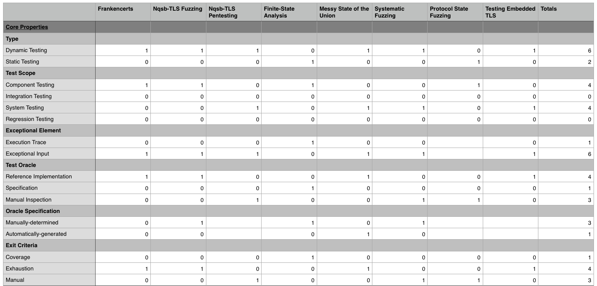 
Fig. 3: Core Properties Classification

This particular table is limited to the *core properties*. In order to break down the information in this table, we shall consider several salient observations that can be drawn from the data.

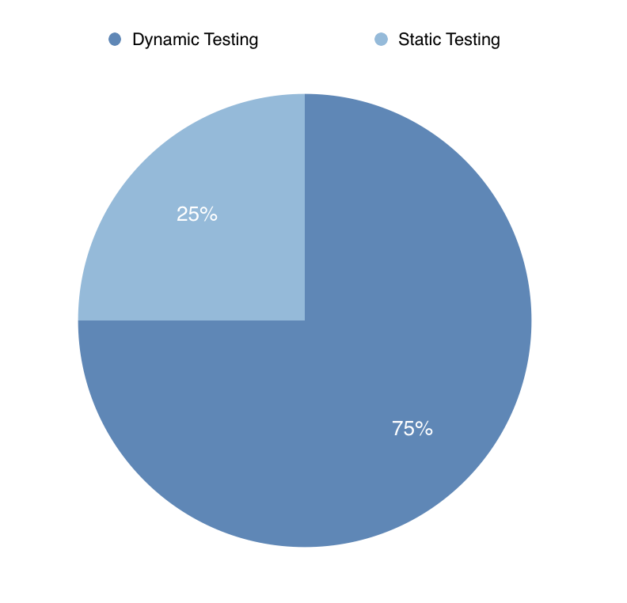 
Fig. 4: Dynamic vs Static Testing

The first observation to note is that the majority of the approaches that were classified use dynamic testing instead of static testing. While this could be due to selection bias, we believe that this more strongly speaks to the difficulty of implementing static testing approaches versus using something like fuzzing or penetration testing. Building a static testing approach requires deep, domain-specific knowledge on how to build mathematically formal models of the TLS security protocol and then execute checking of these models. There seems to be a need for better tooling to aid researchers in applying static testing techniques to security protocol testing and verification.

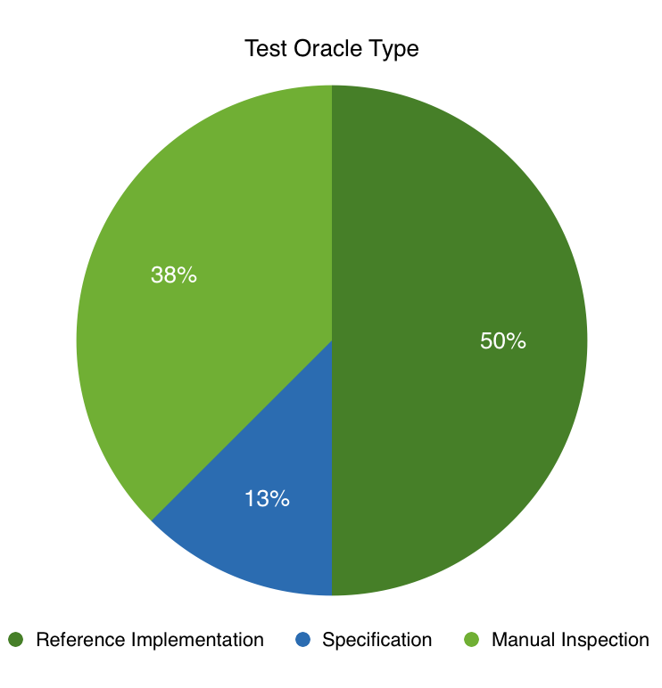 
Fig. 5: Test Oracle Type

We notice a related trend in the selection of the test oracle. The majority of the classified approaches used either a reference implementation or manual inspection, rather than a specification. Although it is not bad practice to use a reference implementation, it would be more fruitful if test oracles were based on clear specifications because:

- Reference implementations are not easily adaptable; unless the reference implementation happens to be a well-supported TLS implementation, it is unlikely that it will be fully maintained.

- Classification based on reference implementations is difficult to automate; while a formal specification is quite easily machine readable and checkable, a reference implementation requires human-level insight in order to draw conclusions about results.

What is more concerning is the use of manual inspection as the test oracle. Manual testing is not scalable -- it consumes researchers' time in a linear manner proportional to the amount of test cases. Manual testing is also as fallible as the researchers who are using it. It stands to reason that if in the original design and construction of TLS implementations flaws were introduced, then it is similarly likely that things will be missed during manual inspection.

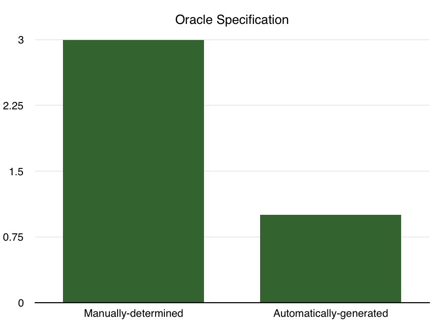 
Fig. 6: Oracle Specification

We find a similar trend in the specification of the test oracle; the majority of teh classified approaches use a manually-determined oracle specification, whether this means that a test implementation's differential behavior had to be manually classified or the model had to be manually encoded in some model design language. In fact, we find that there was only one approach that automatically generated an oracle specification, *A Messy State of the Union*, which was automated in the sense that only valid sequences of messages were sent to the implementations under test and thus it could be known for each message flow that the expected behavior of the implementation under test should be to accept it. Thus any implementation that did not accept the message flow could be automatically classified as having failed the pieces of the TLS specification that the flow embodied.

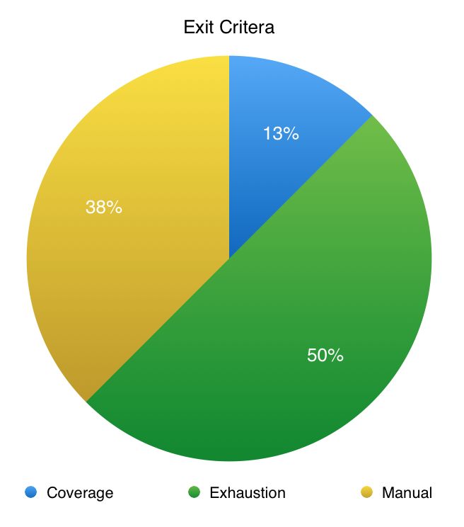 
Fig. 7: Exit Criteria

In the case of the exit criteria, we find that the majority of approaches use either manual or exhaustion, and only one approach uses coverage. We cannot recommend the practice of using a manual exit criteria for two reasons:

- It does not support reproducible work; unless the testing is done in a well-specified, deterministic fashion, there is no guarantee that two researchers using the same stopping point will produce the same results.
- The stopping point is usually arbitrary and thus not well-calibrated to any measured metric.

The use of exhaustion as a stopping criteria is more justifiable, but it also has similar issues. With exhaustion there is still no calibration or way to measure progress in testing. There is some hope that exhaustion will uncover a large amount of faults, however, again, there is no way to measure what has or has not been accomplished. There is no way to know during the course of testing whether a particular vulnerability has already been captured by a one exceptional element that that is replicated in later tests. Thus there can be both unnecessary duplication of tests and flaws easily go missed.

Coverage is the only metric that can prevent this issue because coverage ensures that all of the relevant paths through the program have been tested once. Within the approaches that were surveyed here, coverage was used only in a static setting, but coverage can be produced in a dynamic setting as well with proper instrumentation of the SUT.

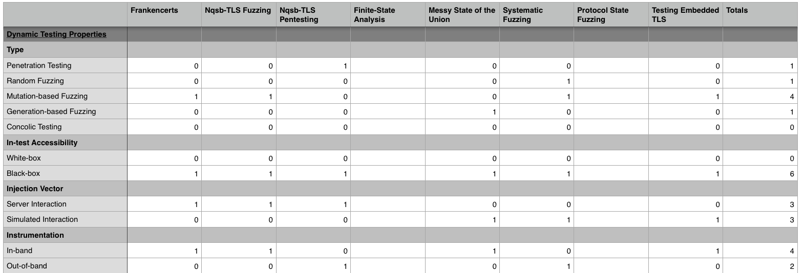 
Fig. 8: Dynamic Properties Classification

This table showcases the results of methods of the *dynamic properties* classification. It is curious to note that there were no methodologies that used white-box in-test accessibility. This probably follows from the fact that all of the tested approaches used some form of fuzzing or penetration testing and none used concolic testing. 

For the injection vector we find that the methodologies were split 50-50 on whether they used server interaction or simulated interaction. We believe that simulated interaction is the better practice in general. This is because simulated interactions can be programmability scripted and thus are carefully controlled and easily documented. Sever interactions on the other hand must be monitored in ad-hoc ways because server implementations don't automatically lend themselves to extensions for testing purposes. 

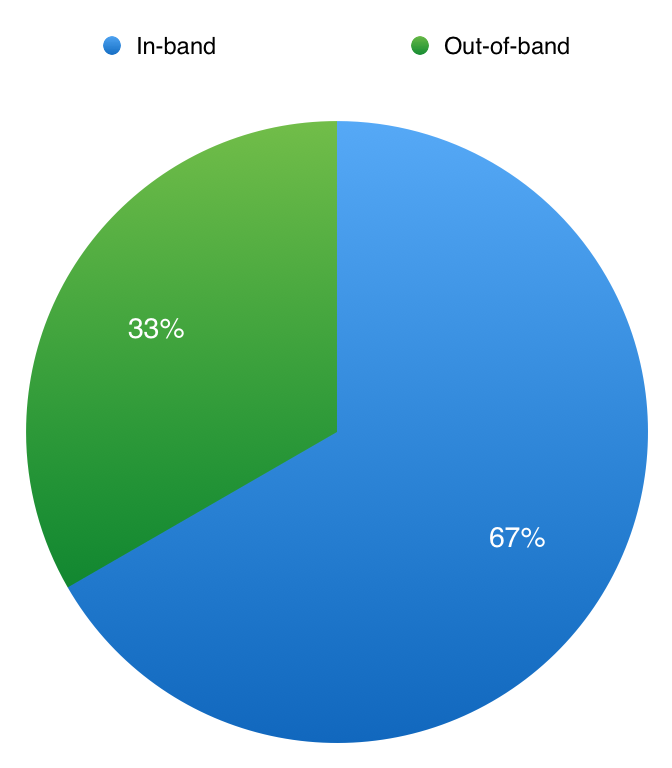 
Fig. 9: Instrumentation

With the instrumentation, we find that most dynamic testing approaches stuck to in-band instrumentation, which means monitoring the SUT from its output or exception traces, rather than out-of-band instrumentation. For the two approaches that used out-of-band instrumentation, is is clear why that was the choice. For penetration testing of nqsb-TLS, it would make sense for the TLS server to be monitored from "outside"; the attackers were third-party and thus their communication with the nqsb-TLS was not directly monitor-able. For *Systematic Fuzzing and Testing of TLS Libraries* the authors chose to uses tools like AddressSanitizer to monitor TLS implementations for memory leakages. Interestingly, we find that there is no correlation between the injection vector and the instrumentation; an approach using out-of-band instrumentation was equally likely to use server interaction or simulated interaction.

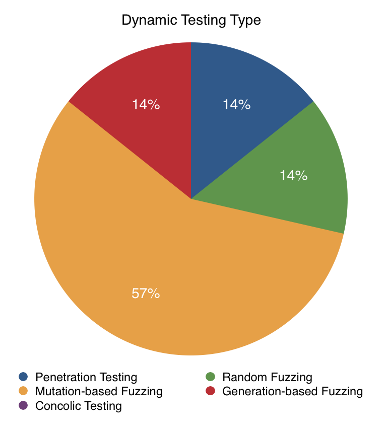 
Fig. 10: Dynamic Testing Type

For the dynamic testing type we see that there is a reasonable mix of approaches. Of course, it should be noted that except for penetration testing and concolic testing (which does not appear in the chart because no approach used it), all of these approaches are some form of fuzzing. This however does not show a lack of diversity in the data set; most dynamic testing approaches are by nature some form of fuzzing because of the broad definition and reach that fuzzing has.

Within the fuzzing approaches we find that the majority use mutation-based fuzzing along the lines of the Frankencerts method. This is understandable as *Frankencerts* showed to be particularly effective and thus inspired a set of similar approaches. Of the forms of fuzzing, the least preferable is probably random fuzzing. This is because random fuzzing is inefficient. Random fuzzing uses no knowledge of the structure of the data and thus must go through a much larger test case space than, say, a mutation-based fuzzing approach in order to cover the same amount of relevant ground. Thus, we recommend that dynamic testing approaches that are using fuzzing stick to mutation-based fuzzing or generation-based fuzzing. We also recommend that concolic testing be applied to testing TLS as it might prove beneficial in terms of reducing the workload researchers have in classifying the results of a fuzzing approach.

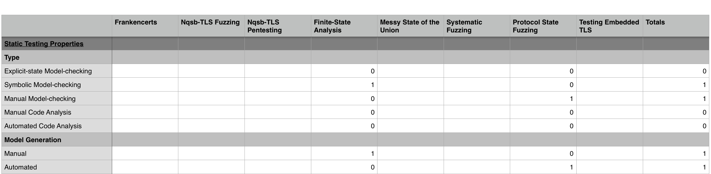 
Fig. 11: Static Properties Classification

In the static properties classification, the main features are the type and the way the model was generated. For the type of the static testing we say that only two of the five listed types wer covered. The two types that were captured by the classified methodologies were symbolic model checking and manual model checking. Thus all of the static testing approaches used some form of model-checking. Of the two forms of model-checking used, we believe that symbolic model checking is much preferable to manual model checking for the same reasons that coverage is preferable to exhaustion or manual exit criteria; manual model checking is is fallible as the researchers who are using it and provides no guarantees in terms what will or will not be covered by the testing. 

Other than model-checking, we see that some form of code analysis could have been done, however no methodology that was classified used either manual or automated code analysis. This is unfortunate because static code analysis has the opportunity to provide direct source code correspondences for faults discovered and thus can cut down researcher time spent on classifying oracle results.

For model checking we see that there is a 50-50 split between manual and automated model checking. This fact is not necessarily quite significant though because of the small sample size. Rather, what is more salient is the fact that there *was* and approach that used automated model generation. This is because automated model generation is much preferable to manual model generation in terms of the time-savings for researchers. Moreover, automated model generation is less fallible than model generation done by researchers -- it is possible that researchers might neglect to include a particular property in their model and thus that property will go untested.

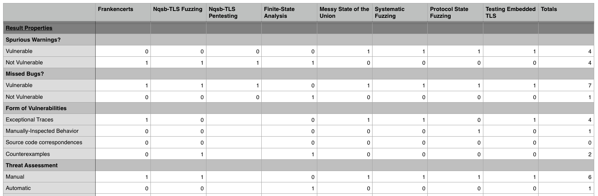 
Fig. 12: Result Properties Classification

Looking at the result properties classification, we see a number of interesting takeaways. The first one to note is that there is a 50-50 split in the results vulnerable or not vulnerable to spurious warnings, or false positives. 

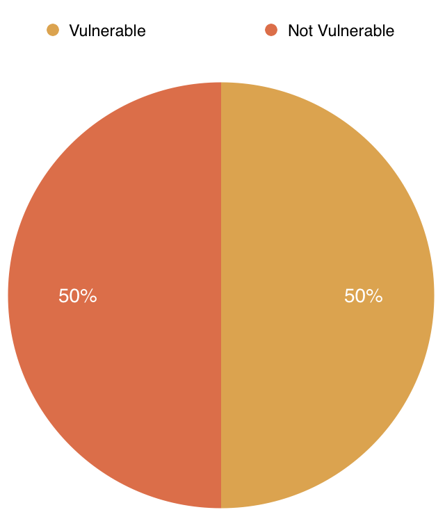 
Fig. 13: Spurious Warnings

Interestingly there is no correlation between whether an approach uses static testing or dynamic testing and is vulnerable to spurious warnings; we see that *Frankencerts*, which uses dynamic testing, is not vulnerable to spurious warnings because it uses discrepancies as its test oracle while *Protocol State Fuzzing of TLS Implementations*, which uses static testing, is vulnerable to spurious warnings. What seems to be more important than the type of testing for determining whether an approach might be vulnerable to spurious warnings is whether the approach in question has randomness or a human element affecting the test oracle. Approaches that use random fuzzing cannot guarantee that they will be testing within the TLS specification. Approaches that require a human to be the test oracle are subject to human fallibility. Ideally, of course, an approach should be as resistant to spurious warnings as possible as this constitutes a waste of researchers' time.

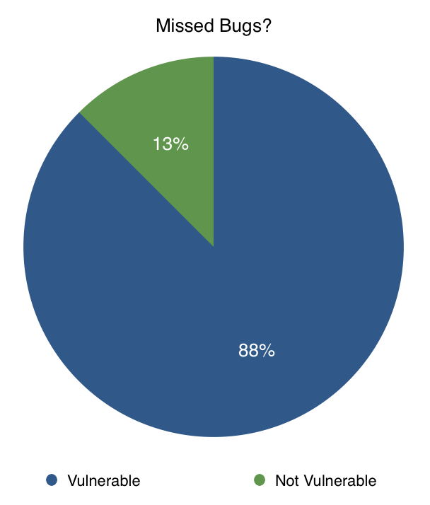 
Fig. 14: Missed Bugs?

For missed bugs, we see quite a different situation; only one approach was not vulnerable to missed bugs, *A Finite State Analysis of SSL 3.0*. There is a clear reason for this; *A Finite State Analysis of SSL 3.0* was the only approach that used coverage as its exit criteria, thus only this approach could claim that all of the possible execution paths were checked. This reinforces the previous claim about the importance of principled, coverage-based exit criteria; without that it will be quite difficult to execute testing that does not miss *something*.

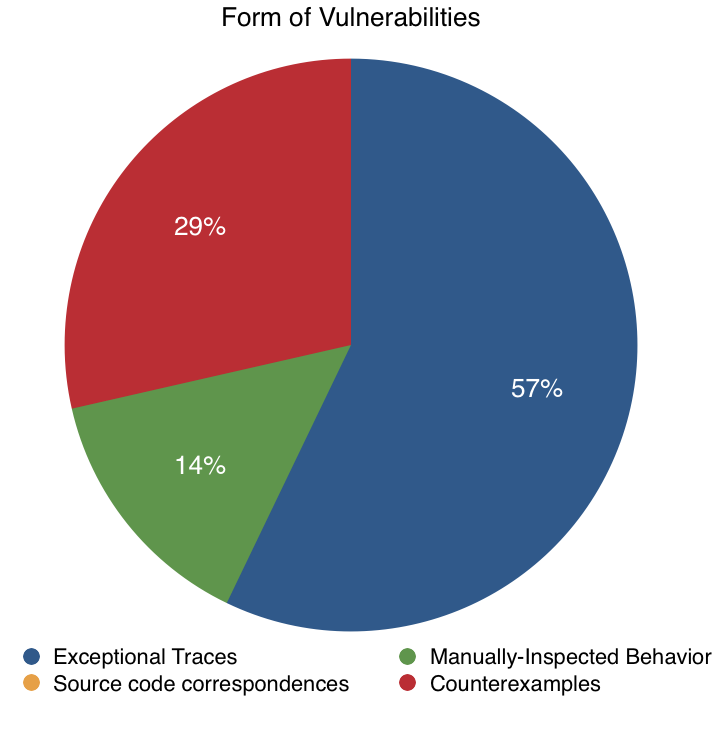 
Fig. 15: Form of Vulnerabilities

For the form of vulnerabilities, we notice that exceptional traces were the most common. The second most common were counterexamples, followed by manually-inspected behavior. Source code correspondences were not the results of any of the classified approaches. We cannot recommend that any approach rely on manual inspection of the behavior of the SUT. In the case of *Protocol State Fuzzing of TLS Libraries*, the reason that manual inspection was used was because the researchers' main thrust of their work was in automating model generation. They said that they could have used some form of automated testing, but they did not because that was not the focus of their work. As usual, the reason that manually-inspected behavior is not recommended is because it is not reliable or principled. Counterexamples, which are essentially synthesized attacks on a protocol, are far more preferable because they are easy to work with, rather than exceptional traces where researchers must read through and classify the importance of the traces manually. The reason that source code correspondences were not found was because none of the approaches worked directly at the level of source code; there was no dynamic testing approach that used concolic execution, and no static testing approach that used manual or automated code analysis.

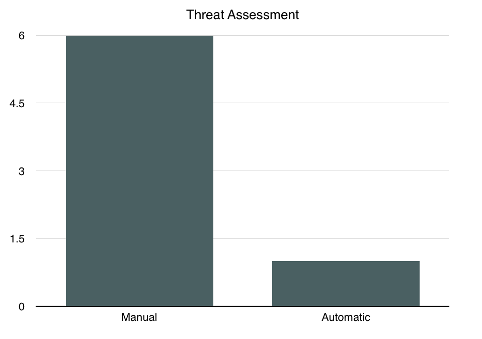 
Fig. 16: Threat Assessment Type

Finally, for the threat assessment type, we find that the majority of approaches used manual threat assessment. This means that given the exceptional behaviors discovered during the course of testing, researchers had to manually determine the cause of the behavior, and once that cause was determined, they had to decide what potential attacks could result from that cause. There is a clear correlation between the form of vulnerabilities received and the threat assessment type; for approaches that had exceptional traces or manually-inspected behavior, they had manual threat assessment. This is because there is no direct correspondence between an exceptional trace or manually-inspected behavior and a potential attack. On the other hand, there is a direct correspondence between a counterexample form of vulnerability and an attack. As previously mentioned, a counterexample is already essentially a proposed attack and thus it the work of determining the threat assessment is already done. Thus we recommend that approaches attempt to have counterexamples as their form of vulnerability discovered in testing. This is not tied to using dynamic or static testing; of the two approaches that had counterexamples, one used dynamic testing with a reference implementation while one used symbolic model checking. Again, we believe that automating threat assessment will aid in reducing the time spent by researchers in classification-type work.

### VI. [!] The Combined Approach

### VII. [!] Results with the Combined Approach

### VIII. [!] Related Works

### IX. [!] Future Research

### X. References

[1] "THE SSL PROTOCOL". Netscape Corporation. 2007.

[2] Rescorla, Eric. SSL and TLS: Designing and Building Secure Systems. 2001.

[3] Polk, Tim; McKay, Terry; Chokhani, Santosh (April 2014). "Guidelines for the Selection, Configuration, and Use of Transport Layer Security (TLS) Implementations" 

[4] Dierks, T. & E. Rescorla (April 2006). "The Transport Layer Security (TLS) Protocol Version 1.1, RFC 4346".

[5] RFC 5246

[6] Thai Duong & Juliano Rizzo (2011-05-13). "Here Come The ⊕ Ninjas".

[7] Rizzo, Juliano; Duong, Thai. "The CRIME attack"

[8] Lucky Thirteen: Breaking the TLS and DTLS Record Protocols

[9] Bodo Möller, Thai Duong & Krzysztof Kotowicz. "This POODLE Bites: Exploiting The SSL 3.0 Fallback"

[10] RFC 6176

[11] P. Bourque and R. Dupuis, editors. Guide to the Software Engineering
Body of Knowledge Version 3.0 SWEBOK. IEEE, 2014.

[12] OWASP Testing Guide

[13] https://hpbn.co/transport-layer-security-tls/

[14] RFC 5280

[15] P. Ammann and J. Offutt. Introduction to Software Testing. Cambridge University Press, Cambridge, UK, 2008.

[16] ISO/IEC. Information technology – open systems interconnection – conformance testing methodology and framework, 1994. International ISO/IEC multi–part standard No. 9646.

[17] Felderer, Michael et al. Security Testing: A Survey.

[18] Schulzrinne, Henning et al. Security testing of SIP implementations.

[19] Committee on National Security Systems. 4009, ”National Information Assurance Glossary”. Technical report, Committee on National Security Systems, 2010.

[20] IEEE. IEEE Standard for Software and System Test Documentation. IEEE Std 829-2008, 2008.

[21] K. Scarfone, M. Souppaya, A. Cody, and A. Orebaugh. Technical Guide to Information Security Testing and Assessment. Special Publication 800-115, National Institute of Standards and Technology (NIST), 2008.

[22] H. Shahriar and M. Zulkernine. Automatic testing of program security vulnerabilities. In Computer Software and Applications Conference, 2009. COMPSAC’09. 33rd Annual IEEE International, volume 2, pages 550–555. IEEE, 2009.

[23] D. Yang, Y. Zhang, and Q. Liu. Blendfuzz: A model-based framework for fuzz testing programs with grammatical inputs. In G. Min, Y. Wu, L. C. Liu, X. Jin, S. A. Jarvis, and A. Y. Al-Dubai, editors, 11th IEEE International Conference on Trust, Security and Privacy in Computing and Communications, TrustCom 2012, Liverpool, United Kingdom, June 25-27, 2012, pages 1070–1076. IEEE Computer Society, 2012.

[24] S. Bekrar, C. Bekrar, R. Groz, and L. Mounier. A taint based approach for smart fuzzing. In G. Antoniol, A. Bertolino, and Y. Labiche, editors, 2012 IEEE Fifth International Conference on Software Testing, Verification and Validation, Montreal, QC, Canada, April 17-21, 2012, pages 818–825. IEEE, 2012.

[25] D’Silva, Vijay et Al. A Survey of Automated Techniques for Formal Software Verification. Transactions on CAD.

[26] E. M. Clarke and E. A. Emerson. Design and synthesis of synchronization skeletons using branching-time temporal logic. In Logic of Programs, volume 131 of LNCS, pages 52–71. Springer, 1981.

[27] S. Demri, F. Laroussinie, and P. Schnoebelen. A parametric analysis of the state-explosion problem in model checking. Compututer and System Sciences, 72(4):547–575, 2006.

[28] R. E. Bryant. Graph-based algorithms for Boolean function manipulation. IEEE Transactions on Computers, 35(8):677–691, 1986.

[29] J. R. Buchi. Regular canonical systems. Archive for Mathematical Logic, 6(3-4):91, April 1964.

[30] Y. Kesten, O. Maler, M. Marcus, A. Pnueli, and E. Shahar. Symbolic model checking with rich ssertional languages. In Computer Aided
Verification (CAV), volume 1254 of LNCS, pages 424–435. Springer, 1997.

[31] Blanchet, Bruno. Security Protocol Verification: Symbolic and Computational Models.

[32] Chad Brubaker, Suman Jana, Baishakhi Ray, Sarfraz Khurshid, and Vitaly Shmatikov. 2014. Using Frankencerts for Automated Adversarial Testing of Certificate Validation in SSL/TLS Implementations. In Proceedings of the 2014 IEEE Symposium on Security and Privacy (SP '14). IEEE Computer Society, Washington, DC, USA, 114-129.

[33] John C. Mitchell, Vitaly Shmatikov, and Ulrich Stern. 1998. Finite-state analysis of SSL 3.0. In Proceedings of the 7th conference on USENIX Security Symposium - Volume 7 (SSYM'98), Vol. 7. USENIX Association, Berkeley, CA, USA, 16-16.

[34] David Kaloper-Meršinjak, Hannes Mehnert, Anil Madhavapeddy, and Peter Sewell. 2015. Not-quite-so-broken TLS: lessons in re-engineering a security protocol specification and implementation. In Proceedings of the 24th USENIX Conference on Security Symposium (SEC'15), Jaeyeon Jung (Ed.). USENIX Association, Berkeley, CA, USA, 223-238.

[35] B. Beurdouche et al., "A Messy State of the Union: Taming the Composite State Machines of TLS," 2015 IEEE Symposium on Security and Privacy, San Jose, CA, 2015, pp. 535-552.

[36] Juraj Somorovsky. 2016. Systematic Fuzzing and Testing of TLS Libraries. In Proceedings of the 2016 ACM SIGSAC Conference on Computer and Communications Security (CCS '16). ACM, New York, NY, USA, 1492-1504

[37] Joeri de Ruiter and Erik Poll. Protocol State Fuzzing of TLS Implementations. 24th USENIX Security Symposium (USENIX Security 15). 2015. 978-1-931971-232. Washington, D.C. 193--206.

[38] Walz, Andreas, and Axel Sikora. "Testing embedded TLS implementations using fuzzing techniques and differential testing." BW-CAR SINCOM (2015): 36.

